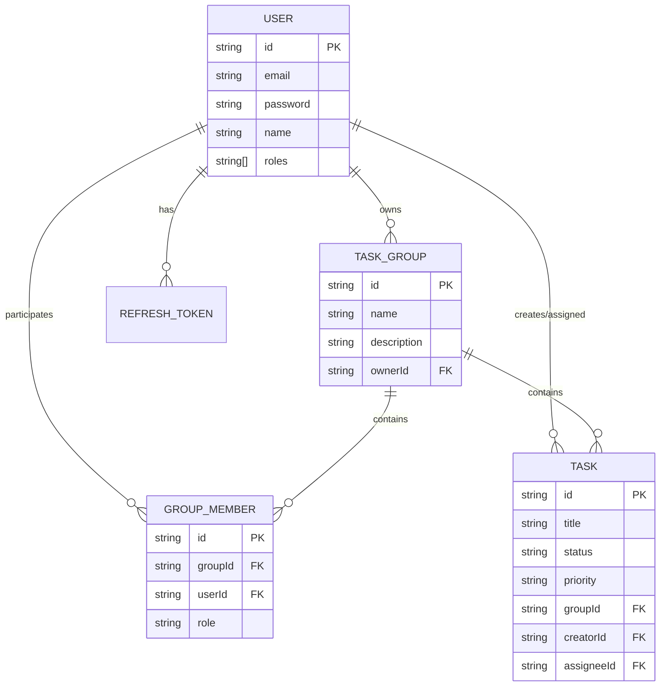

# Entity Relationship Diagram (ERD)
### Overview
Sơ đồ cơ sở dữ liệu cho hệ thống TodoList Co-op

```mermaid
erDiagram
    USER ||--o{ TASK_GROUP : "owns"
    USER ||--o{ GROUP_MEMBER : "participates"
    USER ||--o{ TASK : "creates/assigned"
    USER ||--o{ REFRESH_TOKEN : "has"
    
    TASK_GROUP ||--o{ GROUP_MEMBER : "contains"
    TASK_GROUP ||--o{ TASK : "contains"
    
    USER {
        string id PK
        string email
        string password
        string name
        string[] roles
    }
    
    TASK_GROUP {
        string id PK
        string name
        string description
        string ownerId FK
    }
    
    GROUP_MEMBER {
        string id PK
        string groupId FK
        string userId FK
        string role
    }
    
    TASK {
        string id PK
        string title
        string status
        string priority
        string groupId FK
        string creatorId FK
        string assigneeId FK
    }
```
